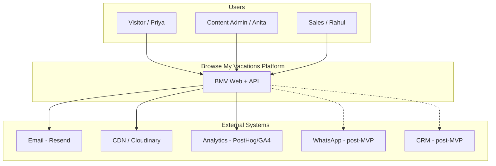
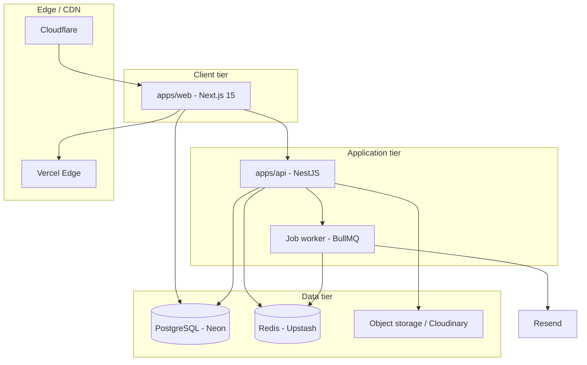
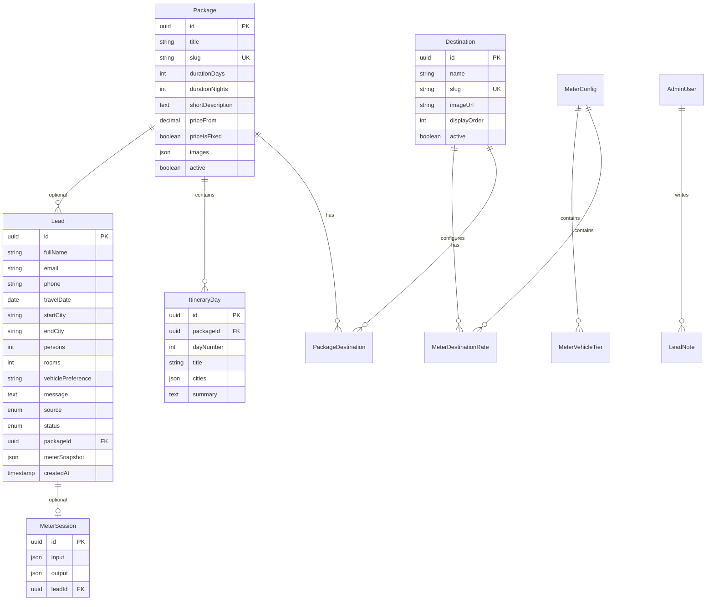
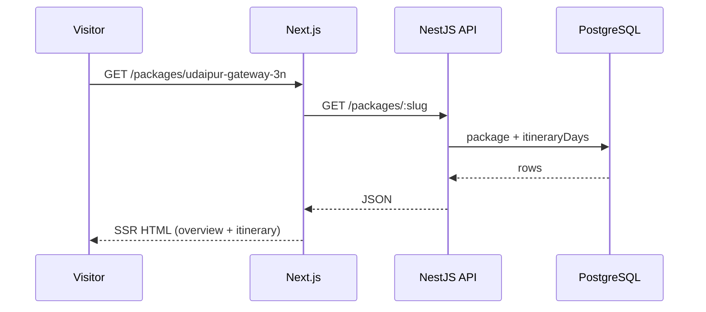
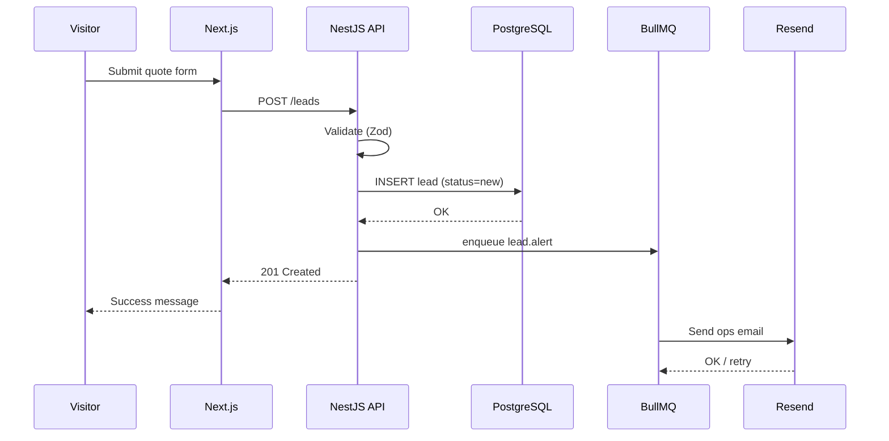
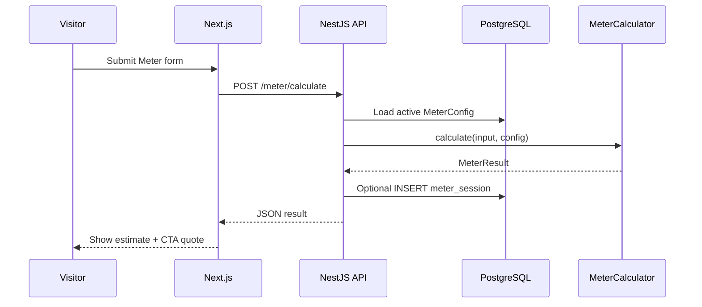
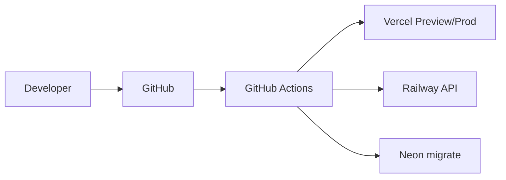

# Browse My Vacations — Architecture Plan

| Field | Value |
|-------|--------|
| **Document version** | 1.0 |
| **Status** | Draft — for technical review |
| **Date** | 22 May 2026 |
| **Product** | Browse My Vacations (BMV) |
| **Source documents** | [BUSINESS_REQUIREMENTS.md](./BUSINESS_REQUIREMENTS.md), [USE_CASE_REQUIREMENTS.md](./USE_CASE_REQUIREMENTS.md), [USER_STORIES.md](./USER_STORIES.md), [TEST_CASES.md](./TEST_CASES.md), `Browse My Vacations - Draft .pdf` |

---

## 1. Executive summary

Browse My Vacations is an **operator-led, lead-generation travel platform**: visitors browse curated packages, estimate trips via **Vacation Meter**, and submit **custom quote** requests. Sales fulfills quotes offline; there is **no MVP payment or customer login**.

This architecture plan defines a **modular monolith-friendly** system: a **Next.js** public site and admin UI, a **REST API** backed by **PostgreSQL**, asynchronous **lead notifications**, and a **config-driven Meter engine**. The design prioritizes **SEO**, **mobile performance**, **admin self-service**, and **clear extension points** for post-MVP features (filters, Razorpay, CRM, Meilisearch).

**Recommended MVP topology:** Monorepo with `apps/web` (Next.js full-stack surface) + `apps/api` (NestJS) + `packages/database` (Prisma), deployed to **Vercel** (web) and **Railway/Render** (API) with **Neon** (Postgres).

---

## 2. Architecture drivers (from requirements)

| Driver | Source | Architectural response |
|--------|--------|-------------------------|
| SEO for destinations/packages | NFR-003, US-DETL-04 | Next.js SSR/ISR, slug URLs, sitemap |
| Mobile-first browse | NFR-002, US-DISC-06 | Responsive UI, image CDN, LCP budget |
| Simple city search (&lt;500ms) | BUS-001–003, NFR-001 | Postgres full-text / indexed city join; Meilisearch post-MVP |
| Same-page itinerary | BUS-006, FR-022 | Single package detail route; server-rendered sections |
| Quote → lead in &lt;1 min | AC-004, UC-015 | Sync persist + async email job |
| Meter rules without deploy | BUS-010, US-ADM-05 | `MeterConfig` tables + calculation service |
| Admin publishes catalog | FR-050, US-ADM-* | Protected admin app + CRUD API |
| No MVP auth for visitors | BRD §5.2 | Public read APIs; rate-limited writes |
| PII in leads | NFR-005, NFR-007 | Encrypted DB, HTTPS, input validation |
| Future payments/CRM | BRD §5.3 | Webhook interfaces; `Lead` extensibility |

---

## 3. Architecture principles

1. **Boring technology** — Postgres + TypeScript end-to-end; avoid premature microservices.  
2. **SEO-first public routes** — Server-render package and destination pages.  
3. **Config over code for Meter** — Business changes rates in admin, not redeploys.  
4. **Thin visitor writes** — Quote and Meter POST only; no customer session MVP.  
5. **Fail-safe leads** — Persist lead before sending email; retry notifications.  
6. **One package detail truth** — API returns overview + itinerary in one payload (BUS-006).  
7. **Traceable boundaries** — Modules map to use cases (catalog, leads, meter, admin).

---

## 4. System context (C4 — Level 1)



| Actor | Interactions |
|-------|----------------|
| **Visitor** | Browse, search, Meter, submit quote/contact/MICE |
| **Content Admin** | CRUD destinations, packages, Meter config |
| **Sales** | View/update leads, export CSV |
| **Email provider** | Transactional lead alerts (and optional customer ack) |

---

## 5. Container architecture (C4 — Level 2)



### 5.1 Container responsibilities

| Container | Responsibility | Key use cases |
|-----------|----------------|---------------|
| **apps/web** | Public pages, admin UI, SSR/ISR, form UX | UC-001–014, UC-016–020 |
| **apps/api** | REST API, validation, Meter engine, lead creation | UC-002, UC-005–007, UC-015–020 |
| **Worker** | Email send, retry, future webhooks | UC-015 |
| **PostgreSQL** | System of record | All entities |
| **Redis** | Cache, rate limits, job queue | NFR-001, UC-015 |
| **CDN/media** | Package images | FR-015, US-ADM-04 |

### 5.2 Deployment mapping

| Container | MVP host | Notes |
|-----------|----------|-------|
| `apps/web` | **Vercel** | Region `bom1` (Mumbai) preferred |
| `apps/api` | **Railway** or **Render** | Docker image from monorepo |
| PostgreSQL | **Neon** | Serverless Postgres, pooling |
| Redis | **Upstash** | Serverless Redis |
| Media | **Cloudinary** or **S3 + CloudFront** | Transform images for cards |
| DNS/WAF | **Cloudflare** | SSL, caching static assets |

**Alternative (smaller team):** Single Next.js app with Route Handlers + Prisma on Vercel only; extract `apps/api` when Meter logic or admin complexity grows.

---

## 6. Application structure (monorepo)

```text
browsemyvacations/
├── docs/                         # BRD, architecture, user stories, tests
├── frontend/                     # Next.js 15 — Vercel
│   ├── src/app/                  # pages per wireframe
│   └── .env / .env.example
├── backend/                      # NestJS — Railway / Render (Dockerfile)
│   ├── src/                      # health + prisma; feature modules next sprints
│   └── .env / .env.example
├── database/                     # @bmv/database — Prisma
│   ├── prisma/schema.prisma
│   └── .env / .env.example
├── docker-compose.yml            # local Postgres + Redis
├── .github/workflows/ci.yml
├── package.json
└── pnpm-workspace.yaml
```

---

## 7. Component design (C4 — Level 3)

### 7.1 Catalog module

| Component | Responsibility | FR / UC |
|-----------|----------------|---------|
| `DestinationService` | List active destinations, ordered | FR-014, UC-001 |
| `PackageService` | Package by slug, with itinerary days | FR-020–022, UC-004 |
| `SearchService` | City/combination query | FR-012–013, UC-002 |
| `SuggestionService` | Home suggestion bar items | FR-011, UC-003 |
| `PackageRepository` | Prisma queries, active filter | — |

**Search strategy (MVP):**

```sql
-- Conceptual: packages where any linked destination or itinerary city matches query
SELECT p.* FROM packages p
JOIN package_destinations pd ON pd.package_id = p.id
JOIN destinations d ON d.id = pd.destination_id
WHERE p.active = true
  AND (d.name ILIKE :q OR d.slug ILIKE :q OR p.title ILIKE :q)
```

- Index: `destinations.slug`, `packages.active`, GIN on `packages.search_vector` (optional).  
- **Post-MVP:** Meilisearch index synced on package publish (BRD deferred filters).

**Caching:** ISR for home (60s) and package detail (300s); invalidate on admin publish via `revalidatePath` webhook.

### 7.2 Leads module

| Component | Responsibility | FR / UC |
|-----------|----------------|---------|
| `LeadService` | Create lead, attach package/Meter snapshot | FR-030–036, UC-005 |
| `LeadValidator` | Zod schema shared with web | FR-033 |
| `LeadNotificationQueue` | Enqueue email job | UC-015 |
| `LeadAdminService` | List, filter, status, notes, export | FR-051, UC-019–020 |

**Lead sources (enum):** `package_card` | `package_detail` | `vacation_meter` | `contact` | `mice`

**Status pipeline:** `new` → `contacted` → `quoted` → `won` | `lost`

### 7.3 Vacation Meter module

| Component | Responsibility | FR / UC |
|-----------|----------------|---------|
| `MeterConfigService` | Load rates, tiers, seasons from DB | FR-052, UC-018 |
| `MeterCalculator` | Pure function: inputs + config → estimate | FR-042, UC-006 |
| `MeterSessionService` | Optional persist for analytics | BRD §10 |

**Calculation interface (pending OQ-004):**

```typescript
interface MeterInput {
  destinationIds: string[];
  totalNights: number;
  pickupTime: string;   // HH:mm
  dropoffTime: string;
  travelDate: string;   // ISO date
}

interface MeterResult {
  estimateMin?: number;
  estimateMax?: number;
  estimateFixed?: number;
  currency: 'INR';
  disclaimer: string;
  breakdown?: { label: string; amount: number }[];
}
```

**Design rule:** `MeterCalculator` has **no I/O** — unit-testable against fixture configs (TC-UC006-04).

### 7.4 Notifications module

| Component | Responsibility |
|-----------|----------------|
| `EmailSender` | Resend adapter |
| `LeadAlertTemplate` | Ops email with lead summary |
| `NotificationProcessor` | BullMQ consumer, retry 3x |

**Flow:** API saves lead → commits transaction → pushes job → worker sends email → logs `notification_status` on lead.

### 7.5 Admin auth module

| Component | Responsibility |
|-----------|----------------|
| `AdminAuthGuard` | JWT or session cookie for `/admin` and `/api/admin/*` |
| `RoleGuard` | `content_admin` vs `sales` (optional MVP: single admin role) |

**MVP:** Email/password or magic link for 2–5 internal users; no visitor auth.

---

## 8. Data architecture

### 8.1 Entity relationship (conceptual)



### 8.2 Prisma model highlights

| Model | Notes |
|-------|-------|
| `Destination` | Slug unique; `active` gates public sections |
| `Package` | `priceFrom` + `priceIsFixed`; soft delete via `active` |
| `PackageDestination` | M2M for search match (OQ-005: any linked dest) |
| `ItineraryDay` | Ordered by `dayNumber`; cities as `String[]` |
| `Lead` | PII; index `(status, createdAt)` for admin |
| `LeadNote` | Internal only |
| `MeterConfig` | Singleton or versioned effective-date rows |
| `MeterDestinationRate` | Per-destination base night rate |
| `MeterVehicleTier` | Multiplier by vehicle type |
| `Suggestion` | Label, `destinationId` or `packageId`, `displayOrder` |
| `SiteContent` | About, Contact copy (CMS-lite MVP) |

### 8.3 Data retention and privacy

| Data | Retention | Notes |
|------|-----------|-------|
| Leads | 24 months default | Configurable; export before delete |
| Meter sessions | 90 days | Analytics; anonymize if needed |
| Admin audit | 12 months | Status changes on leads |

Align with India **DPDP** — privacy policy, consent checkbox on quote form (US-PLAT-05).

---

## 9. API design

### 9.1 Public API (unauthenticated, rate-limited)

| Method | Endpoint | Purpose | UC |
|--------|----------|---------|-----|
| GET | `/api/v1/destinations` | Active destinations | UC-001 |
| GET | `/api/v1/packages` | List/filter (`?destination=udaipur`) | UC-001, UC-011 |
| GET | `/api/v1/packages/:slug` | Detail + itinerary[] | UC-004 |
| GET | `/api/v1/search?q=udaipur` | City search | UC-002 |
| GET | `/api/v1/suggestions` | Home suggestion bar | UC-003 |
| POST | `/api/v1/leads` | Create quote/contact lead | UC-005, UC-013 |
| POST | `/api/v1/meter/calculate` | Run Meter | UC-006 |
| GET | `/api/v1/health` | Health check | Ops |

**Package detail response shape (BUS-006):**

```json
{
  "id": "...",
  "title": "3 Nights Udaipur Gateway",
  "slug": "udaipur-gateway-3n",
  "duration": { "days": 4, "nights": 3 },
  "price": { "display": 24500, "isFixed": false, "currency": "INR" },
  "overview": { "description": "...", "highlights": [], "inclusions": [], "exclusions": [] },
  "itinerary": [
    { "dayNumber": 1, "title": "Arrival", "cities": ["Udaipur"], "summary": "..." }
  ]
}
```

### 9.2 Admin API (authenticated)

| Method | Endpoint | Purpose | UC |
|--------|----------|---------|-----|
| CRUD | `/api/v1/admin/destinations` | Manage destinations | UC-016 |
| CRUD | `/api/v1/admin/packages` | Manage packages + itinerary | UC-017 |
| POST | `/api/v1/admin/packages/:id/images` | Upload media | UC-017 |
| GET/PATCH | `/api/v1/admin/meter-config` | Meter rules | UC-018 |
| GET/PATCH | `/api/v1/admin/leads` | List, status, notes | UC-019 |
| GET | `/api/v1/admin/leads/export` | CSV export | UC-020 |

### 9.3 Rate limiting

| Endpoint | Limit | Rationale |
|----------|-------|-----------|
| POST `/leads` | 5 / IP / hour | Spam prevention |
| POST `/meter/calculate` | 30 / IP / hour | Abuse prevention |
| Admin | Auth required | — |

---

## 10. Key sequence flows

### 10.1 Browse package detail (read path)



### 10.2 Submit quote (write path)



### 10.3 Vacation Meter calculate



---

## 11. Frontend architecture (apps/web)

### 11.1 Route and rendering strategy

| Route | Rendering | Revalidate | Stories |
|-------|-----------|------------|---------|
| `/` | ISR 60s | On publish webhook | US-DISC-* |
| `/packages` | ISR 60s | On publish | US-DISC-05 |
| `/packages/[slug]` | ISR 300s or SSR | On package save | US-DETL-* |
| `/vacation-meter` | Client + API | — | US-METER-* |
| `/about`, `/contact`, `/mice` | Static / ISR | Rare | US-INFO-* |
| `/admin/*` | Client (protected) | — | US-ADM-*, US-SALE-* |

### 11.2 UI stack

| Layer | Choice |
|-------|--------|
| Framework | Next.js 15 App Router, TypeScript |
| Styling | Tailwind CSS + shadcn/ui |
| Forms | React Hook Form + Zod (shared schemas in `packages/shared`) |
| Data fetching | TanStack Query for client; `fetch` in RSC for SSR |
| Images | `next/image` + Cloudinary CDN delivery (`deliverCdnImageUrl`) |
| Analytics | PostHog or GA4 events (US-PLAT-05) |

### 11.3 Key UI components

| Component | Maps to |
|-----------|---------|
| `SiteHeader` | FR-001, UC-010 |
| `HeroSearch` | FR-012, BUS-002 |
| `SuggestionBar` | FR-011, UC-003 |
| `DestinationSection` | FR-014 |
| `PackageCard` | FR-015, BUS-005 |
| `PackageDetail` + `ItineraryList` | FR-022, BUS-006 |
| `QuoteFormModal` | FR-030–032, BUS-007 |
| `VacationMeterForm` + `MeterResult` | FR-041–043 |
| `MeterPromoPopup` | FR-016–017, sessionStorage dismiss |
| `AdminDataTable` | UC-019 leads list |

**Popup dismiss (OQ-006):** `sessionStorage.setItem('meter_popup_dismissed', '1')` — no server state MVP.

---

## 12. Security architecture

| Concern | MVP approach |
|---------|----------------|
| Transport | HTTPS everywhere (TC-NFR-03) |
| Admin auth | JWT httpOnly cookie or NextAuth credentials provider |
| Public writes | Rate limit + honeypot field on lead form |
| Input validation | Zod server-side; sanitize HTML in message fields |
| PII | Postgres at rest encryption (Neon); minimal fields collected |
| Secrets | Vercel/Railway env vars; never in repo |
| CORS | API allows web origin only |
| CSP | Strict script-src on public pages |

**Roles (MVP):** `admin` (full), `sales` (leads read/update only) — optional split.

---

## 13. Non-functional requirements mapping

| NFR | Target | Implementation |
|-----|--------|----------------|
| NFR-001 Performance | LCP &lt;2.5s; search &lt;500ms | ISR, image CDN, DB indexes, Redis cache for search |
| NFR-002 Mobile | Responsive | Tailwind breakpoints; touch targets |
| NFR-003 SEO | Meta + sitemap | `generateMetadata`, `/sitemap.xml`, structured data `TouristTrip` |
| NFR-004 Accessibility | WCAG 2.1 AA | shadcn a11y, form labels, focus rings |
| NFR-005 Security | HTTPS, sanitize | See §12 |
| NFR-006 Availability | 99.5% | Managed hosts; health checks |
| NFR-007 Privacy | Policy + consent | Static page + form checkbox |
| NFR-008 Analytics | Funnel events | `package_view`, `quote_submit`, `meter_complete` |

---

## 14. Integrations

| System | MVP | Integration pattern |
|--------|-----|---------------------|
| **Resend** | Yes | Worker sends `lead.alert` template |
| **Cloudinary** | Yes | Edge CDN for tourism/package/brand images via fetch + admin upload → URL stored on package |
| **PostHog / GA4** | Yes | Client SDK on web |
| **WhatsApp Business** | Post-MVP | Deep link pre-filled from lead; or API notify |
| **Zoho/HubSpot CRM** | Post-MVP | Webhook on lead create from worker |
| **Razorpay** | Post-MVP | New `payments` module; webhook handler |

---

## 15. Infrastructure and CI/CD



| Stage | Actions |
|-------|---------|
| PR | Lint, typecheck, unit tests, Prisma validate |
| Merge to `main` | Deploy web (Vercel), API (Railway), run migrations |
| Staging | `staging.*` URLs; QA runs TEST_CASES P0 |
| Production | Manual promote; smoke TC-E2E-01 |

**Local dev:** `docker compose up` (Postgres, Redis) + `pnpm dev` (Turborepo).

---

## 16. Architecture decisions (ADRs)

| ADR | Decision | Rationale | Alternatives rejected |
|-----|----------|-----------|------------------------|
| ADR-001 | Monorepo (pnpm + Turborepo) | Shared Zod types between web and API | Separate repos — duplication |
| ADR-002 | Next.js + NestJS split | Clear API boundary for mobile/CRM later | Pure Next.js only — OK for phase 0, split before Meter complexity |
| ADR-003 | PostgreSQL sole source of truth | Relational catalog + leads fit SQL | Firestore — weak itinerary queries |
| ADR-004 | ISR for catalog pages | SEO + performance (NFR-001, NFR-003) | CSR only — poor SEO |
| ADR-005 | Async email via queue | AC-004 reliability | Sync email in request — blocks user, fails open |
| ADR-006 | Meter config in DB | BUS-010, US-ADM-05 | Hard-coded formula — requires deploy |
| ADR-007 | No visitor auth MVP | BRD §5.2 | Supabase auth — unnecessary scope |
| ADR-008 | Postgres search MVP | &lt;500 packages launch scale | Meilisearch day one — ops overhead |

---

## 17. Implementation phases (aligned to user story sprints)

| Phase | Sprint | Architecture deliverables |
|-------|--------|---------------------------|
| **0 — Foundation** | Pre-S1 | Monorepo scaffold, Prisma schema, Docker compose, CI, Vercel/Railway projects |
| **1 — Catalog** | Sprint 1 | Destinations, packages CRUD, public home ISR, admin auth |
| **2 — Discovery** | Sprint 2 | Search API, package detail route, suggestions table, image upload |
| **3 — Leads** | Sprint 3 | Leads module, BullMQ + Resend, admin lead UI |
| **4 — Meter** | Sprint 4 | MeterConfig tables, MeterCalculator, Meter page, popup |
| **5 — Launch** | Sprint 5 | Sitemap, analytics, export CSV, performance pass, staging UAT |

**Exit criteria per phase:** Related P0 test cases from [TEST_CASES.md](./TEST_CASES.md) pass on staging.

---

## 18. Post-MVP extension points

| Feature | Architectural change |
|---------|------------------------|
| Catalog filters | Meilisearch + `GET /packages?filters=` |
| Customer accounts | Auth provider, `users` table, saved packages |
| Razorpay | `payments` module, webhook, order state machine |
| Reviews | `reviews` table, moderation admin |
| CRM sync | Outbound webhook worker consumer |
| Multi-language | Next.js i18n, translated `SiteContent` |
| WhatsApp | Template messages from lead worker |

---

## 19. Risks and mitigations

| Risk | Impact | Mitigation |
|------|--------|------------|
| OQ-004 Meter formula undefined | Blocks Sprint 4 | Stub calculator + plugin interface; business signs formula doc |
| Email delivery failure | Missed leads | Persist first; retry queue; admin shows `notification_failed` |
| Large images slow LCP | NFR-001 fail | Cloudinary transforms; `priority` on hero only |
| Admin credential leak | Data breach | MFA post-MVP; IP allowlist optional |
| Search ambiguity (OQ-005) | Wrong results | Feature flag `match_mode: any_city \| start_city` in config |

---

## 20. Open questions — architecture impact

| OQ | Architectural decision needed |
|----|------------------------------|
| OQ-001 | `Suggestion` model: `type: destination \| package`, `action: filter \| scroll` |
| OQ-002 | Separate `/packages` route vs home anchor only |
| OQ-004 | `MeterResult` shape: range vs fixed; breakdown line items |
| OQ-005 | `SearchService` join strategy on `PackageDestination` vs `ItineraryDay.cities` |
| OQ-006 | Popup: client-only `sessionStorage` vs cookie |
| OQ-007 | Notification: Resend only vs CRM webhook adapter interface |
| OQ-008 | Zod schema: `phone` required vs optional |

---

## 21. Document traceability

| Architecture section | Requirements source |
|---------------------|---------------------|
| §4–5 System/Container | BRD §5, §9; UC catalog |
| §7 Components | FR-001–052; UC-001–020 |
| §8 Data model | BRD §10; BUS-006–010 |
| §9 API | USE_CASE flows; USER_STORIES epics |
| §10 Sequences | UC-004, UC-005, UC-006, UC-015 |
| §11 Frontend | USER_STORIES EPIC-01–06; NFR-002–003 |
| §13 NFR | BRD §8; TEST_CASES TC-NFR-* |
| §17 Phases | USER_STORIES §13 sprints |
| §20 OQ | BRD §13; USER_STORIES §15 |

---

## 22. Document approval

| Role | Name | Signature | Date |
|------|------|-----------|------|
| Technical lead | | | |
| Product owner | | | |
| DevOps / platform | | | |

---

## 23. Related documents

| Document | Purpose |
|----------|---------|
| [BUSINESS_REQUIREMENTS.md](./BUSINESS_REQUIREMENTS.md) | What to build |
| [USE_CASE_REQUIREMENTS.md](./USE_CASE_REQUIREMENTS.md) | Actor flows |
| [USER_STORIES.md](./USER_STORIES.md) | Backlog and sprints |
| [TEST_CASES.md](./TEST_CASES.md) | Verification |

---

*This architecture plan is the technical blueprint for BMV MVP. Implementation scaffolding should follow §6 repository layout and §17 phases. Update version when ADRs or OQ resolutions change structural decisions.*
