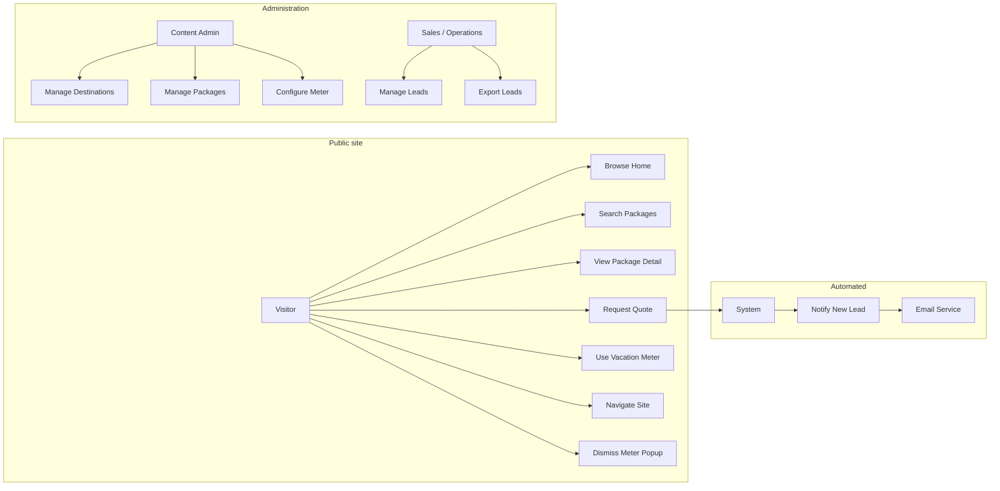

# Browse My Vacations — Use Case Requirements

| Field | Value |
|-------|--------|
| **Document version** | 1.0 |
| **Status** | Draft |
| **Parent document** | [BUSINESS_REQUIREMENTS.md](./BUSINESS_REQUIREMENTS.md) v1.0 |
| **Date** | 22 May 2026 |
| **Product** | Browse My Vacations (BMV) |

---

## 1. Purpose

This document translates the [Business Requirements Document](./BUSINESS_REQUIREMENTS.md) into **use case specifications** suitable for design, development, and test case authoring. Each use case includes actors, pre/postconditions, main and alternate flows, and traceability to functional requirements (FR-xxx) and business rules (BUS-xxx).

---

## 2. Actors

| Actor ID | Actor | Description | Type |
|----------|-------|-------------|------|
| **ACT-01** | **Visitor** | Unauthenticated user browsing the public website | Primary |
| **ACT-02** | **Lead** | Visitor who has submitted a quote or Meter follow-up (same person as Visitor, post-conversion) | Primary |
| **ACT-03** | **Sales / Operations** | Internal staff responding to leads (may use admin or external CRM) | Primary |
| **ACT-04** | **Content Admin** | Internal staff managing destinations, packages, and Meter configuration | Primary |
| **ACT-05** | **System** | Automated processes (notifications, validation, persistence) | Secondary |
| **ACT-06** | **Email Service** | External provider for lead alerts and confirmations | Secondary |

### 2.1 Actor–use case overview

---

## 3. Use case catalog

| UC ID | Use case name | Primary actor | Priority | MVP |
|-------|---------------|---------------|----------|-----|
| UC-001 | Browse home and destination packages | Visitor | Must | Yes |
| UC-002 | Search packages by city or combination | Visitor | Must | Yes |
| UC-003 | Use destination suggestion bar | Visitor | Must | Yes |
| UC-004 | View package details and itinerary | Visitor | Must | Yes |
| UC-005 | Submit custom quote request | Visitor | Must | Yes |
| UC-006 | Calculate trip estimate (Vacation Meter) | Visitor | Must | Yes |
| UC-007 | Request quote from Vacation Meter result | Visitor | Should | Yes |
| UC-008 | Open Vacation Meter from home popup | Visitor | Must | Yes |
| UC-009 | Dismiss Vacation Meter promotional popup | Visitor | Should | Yes |
| UC-010 | Navigate primary site sections | Visitor | Must | Yes |
| UC-011 | Browse full packages catalog | Visitor | Should | Yes |
| UC-012 | View About Us information | Visitor | Should | Yes |
| UC-013 | Contact business | Visitor | Should | Yes |
| UC-014 | Submit MICE inquiry | Visitor | Could | Partial |
| UC-015 | Notify operations of new lead | System | Must | Yes |
| UC-016 | Manage destinations | Content Admin | Must | Yes |
| UC-017 | Manage packages and itineraries | Content Admin | Must | Yes |
| UC-018 | Configure Vacation Meter rules | Content Admin | Must | Yes |
| UC-019 | View and update lead status | Sales / Operations | Must | Yes |
| UC-020 | Export leads | Sales / Operations | Should | Yes |

---

## 4. Use case specifications — Visitor (public)

### UC-001: Browse home and destination packages

| Attribute | Description |
|-----------|-------------|
| **ID** | UC-001 |
| **Name** | Browse home and destination packages |
| **Actor** | Visitor |
| **Description** | Visitor lands on the home page, sees brand messaging and package cards grouped by destination. |
| **Traceability** | FR-002, FR-010, FR-014, FR-015; BR-005, BR-007, BR-008 |

**Preconditions**
1. BMV website is available.
2. At least one active destination and package exist in the catalog.

**Postconditions (success)**
1. Visitor has viewed home content and available package cards.
2. Package impressions may be recorded for analytics (NFR-008).

**Main success scenario**
1. Visitor opens the BMV home page (default route).
2. System displays global navigation, tagline *"Vacations You'll Love. Memories You'll Keep."*, search bar, suggestion bar, and destination sections.
3. System renders each destination section (e.g. "Udaipur") with square package cards showing photo, brief info, price, **View Details**, and **Customise & Quote**.
4. Visitor scrolls and reviews packages.

**Extensions**

| Step | Condition | Action |
|------|-----------|--------|
| 1a | Visitor selects **View Details** on a card | Continue to **UC-004**. |
| 1b | Visitor selects **Customise & Quote** on a card | Continue to **UC-005**. |
| 1c | Visitor uses search bar | Continue to **UC-002**. |
| 1d | Visitor uses suggestion bar | Continue to **UC-003**. |
| 1e | Vacation Meter popup is shown (first visit or per session rule) | Continue to **UC-008** or **UC-009**. |

**Business rules:** BUS-004, BUS-005

---

### UC-002: Search packages by city or combination

| Attribute | Description |
|-----------|-------------|
| **ID** | UC-002 |
| **Name** | Search packages by city or combination |
| **Actor** | Visitor |
| **Description** | Visitor searches by destination city or package combination keyword without entering dates or passenger counts. |
| **Traceability** | FR-012, FR-013; BR-002, BR-003; BUS-001, BUS-002, BUS-003 |

**Preconditions**
1. Visitor is on any page with the search bar (typically home).
2. Active packages exist in the catalog.

**Postconditions (success)**
1. Visitor sees a list of packages matching the search criteria.

**Main success scenario**
1. Visitor enters a city or combination term (e.g. "Udaipur") in the search bar.
2. Visitor submits search (Enter or search button).
3. System matches packages per BUS-003 (any itinerary city includes query, unless business overrides OQ-005).
4. System displays matching packages as cards with the same fields and CTAs as home (UC-001).
5. Visitor reviews results.

**Extensions**

| Step | Condition | Action |
|------|-----------|--------|
| 3a | No packages match | System shows empty state with message and suggestion to browse destinations or clear search. |
| 3b | Query is empty or whitespace | System does not search; optionally prompts to enter a destination. |
| 3c | Visitor selects a package card | Continue to UC-004 or UC-005. |

**Business rules:** BUS-001, BUS-002, BUS-003

---

### UC-003: Use destination suggestion bar

| Attribute | Description |
|-----------|-------------|
| **ID** | UC-003 |
| **Name** | Use destination suggestion bar |
| **Actor** | Visitor |
| **Description** | Visitor selects a quick suggestion (destination or package) from the home suggestion bar. |
| **Traceability** | FR-011; BR-006; OQ-001 |

**Preconditions**
1. Visitor is on the home page.
2. Suggestion bar is configured with at least one item.

**Postconditions (success)**
1. Visitor is shown packages or content related to the selected suggestion.

**Main success scenario**
1. Visitor views the suggestion bar below the tagline/search area.
2. Visitor taps/clicks a suggestion item (e.g. "Udaipur", "Rajasthan Combo").
3. System applies the configured behavior (ASSUMPTION: filter packages same as UC-002 OR scroll to destination section).
4. Visitor sees relevant packages.

**Extensions**

| Step | Condition | Action |
|------|-----------|--------|
| 2a | Suggestion is a destination | System filters or scrolls to that destination’s section (align with OQ-001 decision). |
| 2b | No suggestions configured | System hides suggestion bar or shows placeholder until admin configures (UC-016). |

**Open dependency:** OQ-001

---

### UC-004: View package details and itinerary

| Attribute | Description |
|-----------|-------------|
| **ID** | UC-004 |
| **Name** | View package details and itinerary |
| **Actor** | Visitor |
| **Description** | Visitor opens full package information including a short day-wise itinerary on the same page. |
| **Traceability** | FR-020, FR-021, FR-022, FR-023; BR-010; BUS-006 |

**Preconditions**
1. Target package exists and is active.
2. Visitor reached detail via **View Details** from a card or direct URL.

**Postconditions (success)**
1. Visitor has read package overview and short itinerary on one page.

**Main success scenario**
1. Visitor selects **View Details** on a package card (or opens package URL).
2. System navigates to package detail page for that package.
3. System displays overview: title, duration, displayed price, highlights, inclusions/exclusions (if configured).
4. System displays **short itinerary** immediately below overview on the **same page** (no separate itinerary tab or route).
5. System displays **Customise & Quote** action.
6. Visitor reads content.

**Extensions**

| Step | Condition | Action |
|------|-----------|--------|
| 2a | Package slug invalid or inactive | System shows 404 or “package unavailable” with link to home/packages. |
| 6a | Visitor selects **Customise & Quote** | Continue to **UC-005**. |

**Business rules:** BUS-005, BUS-006

---

### UC-005: Submit custom quote request

| Attribute | Description |
|-----------|-------------|
| **ID** | UC-005 |
| **Name** | Submit custom quote request |
| **Actor** | Visitor (becomes Lead on success) |
| **Description** | Visitor submits trip customization details to receive a manual quote from BMV operations. |
| **Traceability** | FR-030–FR-036; BR-011, BR-020; BUS-007, BUS-008 |

**Preconditions**
1. Visitor has opened the quote form from a package card or package detail page (package context optional for Meter-origin leads in UC-007).
2. Quote form is available.

**Postconditions (success)**
1. Lead record is persisted with submitted data and source package (if applicable).
2. Operations is notified (UC-015).
3. Visitor sees confirmation message.
4. Visitor role effectively becomes **Lead** for follow-up purposes.

**Main success scenario**
1. Visitor selects **Customise & Quote** on a package card or detail page.
2. System opens inquiry form (modal or panel) with fields: Name, Email, Phone, Date to travel, Start city, End city, Number of persons, Rooms needed, Vehicle preference, Message.
3. System pre-associates `package_id` when opened from a specific package.
4. Visitor completes required fields (Name, Email, Phone per FR-033 / OQ-008).
5. Visitor selects **Get Quote**.
6. System validates input.
7. System saves lead with status **New** and metadata (timestamp, source page, package).
8. System triggers lead notification (UC-015).
9. System shows on-screen success confirmation and closes or resets form.

**Extensions**

| Step | Condition | Action |
|------|-----------|--------|
| 6a | Validation fails (missing/invalid email, phone, etc.) | System highlights errors; Visitor corrects and resubmits at step 5. |
| 6b | Network or server error | System shows error message; data not lost if client retains input; Visitor retries. |
| 1a | Visitor cancels/closes form | No lead created; Visitor returns to previous view. |

**Business rules:** BUS-007, BUS-008

**Includes:** UC-015 (notify operations)

---

### UC-006: Calculate trip estimate (Vacation Meter)

| Attribute | Description |
|-----------|-------------|
| **ID** | UC-006 |
| **Name** | Calculate trip estimate (Vacation Meter) |
| **Actor** | Visitor |
| **Description** | Visitor enters trip parameters and receives an estimated trip cost or range from configured business rules. |
| **Traceability** | FR-040, FR-041, FR-042; BR-014; BUS-009, BUS-010 |

**Preconditions**
1. Vacation Meter page is reachable (nav or popup).
2. Meter configuration exists for selected destination(s) (UC-018).

**Postconditions (success)**
1. Visitor has viewed an estimate based on submitted parameters.
2. Meter session may be stored for analytics and optional quote pre-fill (UC-007).

**Main success scenario**
1. Visitor navigates to Vacation Meter (via nav, popup UC-008, or direct URL).
2. System displays Meter form: Select destination(s), Total night stay, Pick-up time, Drop-off time, Date.
3. Visitor enters all required parameters.
4. Visitor submits calculation (e.g. **Calculate** or live update per design).
5. System applies Meter rules from configuration (BUS-010, OQ-004).
6. System displays estimate (single value or range per business definition).
7. System optionally shows disclaimer that estimate is indicative, not a binding quote.

**Extensions**

| Step | Condition | Action |
|------|-----------|--------|
| 5a | Required field missing | System prompts Visitor to complete fields. |
| 5b | Destination not supported in Meter config | System shows message to contact sales or browse packages. |
| 5c | Date or nights outside allowed range | System shows validation message per admin rules. |
| 7a | Visitor selects **Get custom quote** | Continue to **UC-007**. |

**Open dependency:** OQ-004 (formula and output format)

**Business rules:** BUS-009, BUS-010

---

### UC-007: Request quote from Vacation Meter result

| Attribute | Description |
|-----------|-------------|
| **ID** | UC-007 |
| **Name** | Request quote from Vacation Meter result |
| **Actor** | Visitor |
| **Description** | After receiving a Meter estimate, Visitor proceeds to the quote form with known fields pre-filled. |
| **Traceability** | FR-043; Journey B in BRD §9.2 |

**Preconditions**
1. Visitor completed UC-006 successfully.
2. Estimate is displayed on screen.

**Postconditions (success)**
1. Same as UC-005 (lead created and notified).

**Main success scenario**
1. Visitor selects **Get custom quote** (or equivalent CTA) on Meter results.
2. System opens UC-005 quote form with pre-filled fields where possible: Date to travel, Start/End city or destination, Number of persons (if captured), Message stub with Meter summary.
3. Visitor completes remaining required fields.
4. Visitor submits **Get Quote**.
5. System saves lead with `source = vacation_meter` and Meter input snapshot.
6. Continue UC-005 steps 8–9.

**Extensions**

| Step | Condition | Action |
|------|-----------|--------|
| 1a | Visitor skips quote | Visitor may browse packages (UC-001) or recalculate (UC-006). |

**Includes:** UC-005, UC-015

---

### UC-008: Open Vacation Meter from home popup

| Attribute | Description |
|-----------|-------------|
| **ID** | UC-008 |
| **Name** | Open Vacation Meter from home popup |
| **Actor** | Visitor |
| **Description** | Visitor engages the bottom-right home popup to open the Vacation Meter page. |
| **Traceability** | FR-016, FR-040; BR-012, BR-013; BUS-011 |

**Preconditions**
1. Visitor is on the home page.
2. Popup is configured to display per session/marketing rules (OQ-006).

**Postconditions (success)**
1. Visitor is on the Vacation Meter page.

**Main success scenario**
1. System displays promotional popup at bottom-right of home page.
2. Visitor clicks primary action on popup (e.g. **Try Vacation Meter**).
3. System navigates to Vacation Meter page.
4. Continue **UC-006** from step 2.

**Extensions**

| Step | Condition | Action |
|------|-----------|--------|
| 2a | Visitor dismisses popup | Continue **UC-009**. |

**Business rules:** BUS-011

---

### UC-009: Dismiss Vacation Meter promotional popup

| Attribute | Description |
|-----------|-------------|
| **ID** | UC-009 |
| **Name** | Dismiss Vacation Meter promotional popup |
| **Actor** | Visitor |
| **Description** | Visitor closes the home popup without navigating away. |
| **Traceability** | FR-017; BUS-011 |

**Preconditions**
1. Popup is visible on home page.

**Postconditions (success)**
1. Popup is hidden for remainder of session (or per OQ-006 frequency rules).

**Main success scenario**
1. Visitor selects close/dismiss control on popup.
2. System hides popup.
3. Visitor continues browsing home (UC-001).

---

### UC-010: Navigate primary site sections

| Attribute | Description |
|-----------|-------------|
| **ID** | UC-010 |
| **Name** | Navigate primary site sections |
| **Actor** | Visitor |
| **Description** | Visitor uses global navigation to move between main site areas. |
| **Traceability** | FR-001 |

**Preconditions**
1. Site is available.

**Postconditions (success)**
1. Visitor is on the selected section.

**Main success scenario**
1. Visitor selects a nav item: Home, Packages, Vacation Meter, MICE, About Us, or Contact.
2. System loads the corresponding page.

**Extensions**

| Nav item | Target use case |
|----------|-----------------|
| Home | UC-001 |
| Packages | UC-011 |
| Vacation Meter | UC-006 |
| MICE | UC-014 |
| About Us | UC-012 |
| Contact | UC-013 |

---

### UC-011: Browse full packages catalog

| Attribute | Description |
|-----------|-------------|
| **ID** | UC-011 |
| **Name** | Browse full packages catalog |
| **Actor** | Visitor |
| **Description** | Visitor views all available packages from the Packages navigation item. |
| **Traceability** | FR-003; OQ-002 |

**Preconditions**
1. Active packages exist.

**Postconditions (success)**
1. Visitor has browsed catalog listing.

**Main success scenario**
1. Visitor selects **Packages** in navigation.
2. System displays catalog of all active packages (ASSUMPTION: grid/list with same card pattern as home).
3. Visitor browses; may open UC-004 or UC-005 from any card.

**Extensions**

| Step | Condition | Action |
|------|-----------|--------|
| 2a | OQ-002 resolves to “home anchor only” | Nav scrolls to home package sections instead of separate page—document as configuration variant. |

**Open dependency:** OQ-002

---

### UC-012: View About Us information

| Attribute | Description |
|-----------|-------------|
| **ID** | UC-012 |
| **Name** | View About Us information |
| **Actor** | Visitor |
| **Description** | Visitor reads company information and trust content. |
| **Traceability** | FR-004 |

**Preconditions**
1. About Us content is published.

**Postconditions (success)**
1. Visitor has viewed About Us page.

**Main success scenario**
1. Visitor selects **About Us** in navigation.
2. System displays static content: company story, values, credentials, links to Contact.

---

### UC-013: Contact business

| Attribute | Description |
|-----------|-------------|
| **ID** | UC-013 |
| **Name** | Contact business |
| **Actor** | Visitor |
| **Description** | Visitor reaches BMV through contact details or a general inquiry form. |
| **Traceability** | FR-005 |

**Preconditions**
1. Contact page is available.

**Postconditions (success)**
1. Visitor has viewed contact information and/or submitted a general inquiry.

**Main success scenario**
1. Visitor selects **Contact** in navigation.
2. System displays phone, email, address, hours, and optional map/social links.
3. Visitor optionally submits general inquiry form (subset of UC-005 fields or simplified: Name, Email, Phone, Message).
4. If submitted, System creates lead with `source = contact` and triggers UC-015.

**Extensions**

| Step | Condition | Action |
|------|-----------|--------|
| 3a | Visitor uses click-to-call or mailto | No system lead; external channel used. |

---

### UC-014: Submit MICE inquiry

| Attribute | Description |
|-----------|-------------|
| **ID** | UC-014 |
| **Name** | Submit MICE inquiry |
| **Actor** | Visitor (corporate planner) |
| **Description** | Visitor requests information or proposal for meetings, incentives, conferences, or events travel. |
| **Traceability** | FR-006; BRD §12.1 assumption 6; OQ-003 |

**Preconditions**
1. MICE landing page is published.

**Postconditions (success)**
1. MICE lead is stored and operations notified (same pipeline as UC-005 or dedicated type).

**Main success scenario**
1. Visitor selects **MICE** in navigation.
2. System displays MICE overview and inquiry form (fields TBD—ASSUMPTION: company name, contact person, email, phone, event type, estimated group size, preferred destinations, dates, message).
3. Visitor submits inquiry.
4. System validates, saves lead with `type = mice`, notifies operations (UC-015).
5. System shows confirmation.

**Priority:** Could (MVP = static page + minimal form)

**Open dependency:** OQ-003

---

## 5. Use case specifications — System

### UC-015: Notify operations of new lead

| Attribute | Description |
|-----------|-------------|
| **ID** | UC-015 |
| **Name** | Notify operations of new lead |
| **Actor** | System (on behalf of Visitor/Lead) |
| **Secondary actors** | Email Service, Sales / Operations |
| **Description** | When a lead is created, the system alerts operations for timely follow-up. |
| **Traceability** | FR-034; OQ-007 |

**Preconditions**
1. A new lead record was successfully saved (UC-005, UC-007, UC-013, or UC-014).

**Postconditions (success)**
1. Operations receives notification within 1 minute (BRD AC-004).
2. Lead remains in status **New** until updated in UC-019.

**Main success scenario**
1. System detects new lead creation event.
2. System composes notification with lead summary (contact, package, source, Meter snapshot if any).
3. System sends email to configured operations distribution list via Email Service.
4. System optionally creates in-app notification in admin dashboard.

**Extensions**

| Step | Condition | Action |
|------|-----------|--------|
| 3a | Email delivery fails | System retries per policy; logs failure for admin review; lead still stored. |
| 3b | CRM integration enabled (post-MVP) | System also pushes lead to CRM. |

**Included by:** UC-005, UC-007, UC-013, UC-014

---

## 6. Use case specifications — Administration

### UC-016: Manage destinations

| Attribute | Description |
|-----------|-------------|
| **ID** | UC-016 |
| **Name** | Manage destinations |
| **Actor** | Content Admin |
| **Description** | Admin creates and maintains destinations shown in home sections and search. |
| **Traceability** | FR-050 |

**Preconditions**
1. Admin is authenticated to admin area.

**Postconditions (success)**
1. Destination data is saved and reflected on public site when active.

**Main success scenario**
1. Admin opens destination management.
2. Admin creates or edits destination: name, slug, hero image, display order, active flag.
3. Admin saves.
4. System validates uniqueness of slug and persists.
5. Public site shows destination section when active and packages are linked.

**Extensions**

| Step | Condition | Action |
|------|-----------|--------|
| 4a | Admin deactivates destination | Packages may remain but section hidden per business rule (document in admin). |

---

### UC-017: Manage packages and itineraries

| Attribute | Description |
|-----------|-------------|
| **ID** | UC-017 |
| **Name** | Manage packages and itineraries |
| **Actor** | Content Admin |
| **Description** | Admin maintains package catalog content, pricing display, and short itinerary days. |
| **Traceability** | FR-050; BR-008 |

**Preconditions**
1. Admin is authenticated.
2. At least one destination exists for linking.

**Postconditions (success)**
1. Package and itinerary changes are published per save action.

**Main success scenario**
1. Admin opens package management.
2. Admin creates or edits package: title, slug, linked destinations, duration, description, display price, images, highlights, inclusions, exclusions, active flag.
3. Admin adds or edits **short itinerary** rows: day number, title, cities, summary.
4. Admin saves package.
5. System validates and persists package and itinerary.
6. Public cards and detail page (UC-001, UC-004) reflect updates.

**Extensions**

| Step | Condition | Action |
|------|-----------|--------|
| 4a | Admin uploads images | System stores media and associates URLs with package. |
| 4b | Required fields missing | System rejects save with validation errors. |

---

### UC-018: Configure Vacation Meter rules

| Attribute | Description |
|-----------|-------------|
| **ID** | UC-018 |
| **Name** | Configure Vacation Meter rules |
| **Actor** | Content Admin |
| **Description** | Admin defines destinations, rates, and calculation parameters used by UC-006. |
| **Traceability** | FR-052; BUS-010; OQ-004 |

**Preconditions**
1. Admin is authenticated.
2. Business has provided pricing logic (OQ-004 resolved).

**Postconditions (success)**
1. Meter configuration is active for public calculations.

**Main success scenario**
1. Admin opens Vacation Meter configuration.
2. Admin sets supported destinations, base rates, vehicle tiers, night multipliers, date/season rules, and output format (range vs fixed).
3. Admin saves configuration.
4. System validates rules and publishes to Meter engine.
5. UC-006 uses updated rules on next calculation.

---

### UC-019: View and update lead status

| Attribute | Description |
|-----------|-------------|
| **ID** | UC-019 |
| **Name** | View and update lead status |
| **Actor** | Sales / Operations |
| **Description** | Operations reviews incoming leads and progresses them through the sales pipeline. |
| **Traceability** | FR-051 |

**Preconditions**
1. User has admin/sales access.
2. At least one lead exists.

**Postconditions (success)**
1. Lead status and notes reflect current sales state.

**Main success scenario**
1. Sales user opens lead list (filter by New, date, source, package).
2. Sales user selects a lead and reviews contact data, package, Meter snapshot, message.
3. Sales user contacts customer offline (phone, email, WhatsApp).
4. Sales user updates status: **Contacted** → **Quoted** → **Won** or **Lost**.
5. Sales user optionally adds internal notes.
6. System persists updates with timestamp and user.

**Extensions**

| Step | Condition | Action |
|------|-----------|--------|
| 3a | Customer not reachable | Status remains **Contacted** or **New** with note; follow-up scheduled. |

**Business rules:** BUS-008 (manual quote, no auto-price on submit)

---

### UC-020: Export leads

| Attribute | Description |
|-----------|-------------|
| **ID** | UC-020 |
| **Name** | Export leads |
| **Actor** | Sales / Operations |
| **Description** | Operations exports lead data for reporting or external CRM. |
| **Traceability** | FR-051 |

**Preconditions**
1. Sales user has access to lead list.

**Postconditions (success)**
1. File download or CRM sync contains selected lead records.

**Main success scenario**
1. Sales user applies filters on lead list (date range, status, source).
2. Sales user selects **Export** (CSV/Excel).
3. System generates file with lead fields and downloads to user.

---

## 7. Use case relationships

### 7.1 Include relationships

| Base use case | Included use case |
|---------------|-------------------|
| UC-005 Submit custom quote request | UC-015 Notify operations of new lead |
| UC-007 Request quote from Meter result | UC-005, UC-015 |
| UC-013 Contact business (with form) | UC-015 |
| UC-014 Submit MICE inquiry | UC-015 |

### 7.2 Extend relationships

| Base use case | Extension use case | Extension point |
|---------------|-------------------|-----------------|
| UC-001 Browse home | UC-002, UC-003, UC-004, UC-005, UC-008, UC-009 | Visitor action on home |
| UC-006 Vacation Meter | UC-007 | After estimate displayed |
| UC-008 Open Meter from popup | UC-006 | After navigation to Meter page |
| UC-010 Navigate site | UC-001, UC-006, UC-011–UC-014 | Per nav selection |

### 7.3 Generalization (future)

| Parent | Specializations (post-MVP) |
|--------|----------------------------|
| UC-005 Submit quote request | UC-014 MICE inquiry (different field set, same pipeline) |
| UC-002 Search packages | Advanced filtered search (deferred FR) |

---

## 8. End-to-end scenario map

| Scenario | Use case sequence |
|----------|-------------------|
| **Browse → detail → quote** | UC-001 → UC-004 → UC-005 → UC-015 → UC-019 |
| **Search → quote** | UC-002 → UC-005 → UC-015 → UC-019 |
| **Suggestion → quote** | UC-003 → UC-005 → UC-015 → UC-019 |
| **Meter → quote** | UC-008 → UC-006 → UC-007 → UC-015 → UC-019 |
| **Popup dismiss → browse** | UC-001 → UC-009 → UC-001 |
| **Admin publish package** | UC-016 → UC-017 → (public UC-001, UC-004) |
| **Admin configure Meter** | UC-018 → (public UC-006) |

---

## 9. Traceability matrix (use case → BRD)

| Use case | FR IDs | BUS rules | BRD acceptance |
|----------|--------|-----------|----------------|
| UC-001 | FR-002, FR-010, FR-014, FR-015 | BUS-004, BUS-005 | AC-002, AC-007 |
| UC-002 | FR-012, FR-013 | BUS-001–003 | AC-003 |
| UC-003 | FR-011 | — | AC-009 (OQ-001) |
| UC-004 | FR-020–023 | BUS-006 | AC-007 |
| UC-005 | FR-030–036 | BUS-007, BUS-008 | AC-004 |
| UC-006 | FR-040–042 | BUS-009, BUS-010 | AC-005 |
| UC-007 | FR-043 | BUS-008 | — |
| UC-008 | FR-016, FR-040 | BUS-011 | AC-006 |
| UC-009 | FR-017 | BUS-011 | AC-006 |
| UC-010 | FR-001 | — | — |
| UC-011 | FR-003 | — | — |
| UC-012 | FR-004 | — | — |
| UC-013 | FR-005 | — | — |
| UC-014 | FR-006 | — | — |
| UC-015 | FR-034 | BUS-008 | AC-004 |
| UC-016 | FR-050 | — | AC-002 |
| UC-017 | FR-050 | BUS-004 | AC-002 |
| UC-018 | FR-052 | BUS-010 | AC-005 |
| UC-019 | FR-051 | BUS-008 | AC-004 |
| UC-020 | FR-051 | — | — |

---

## 10. Test case hints (per use case)

| UC ID | Minimum test scenarios |
|-------|------------------------|
| UC-001 | Home loads with tagline, sections, cards; mobile layout |
| UC-002 | "Udaipur" returns inclusive packages; empty query handled |
| UC-003 | Each suggestion navigates/filters correctly once OQ-001 closed |
| UC-004 | Itinerary on same page; inactive slug 404 |
| UC-005 | Valid submit creates lead; invalid email blocked; package linked |
| UC-006 | All five inputs required; estimate matches configured rules |
| UC-007 | Pre-fill from Meter; lead source = vacation_meter |
| UC-008 | Popup CTA lands on Meter route |
| UC-009 | Dismiss hides popup for session |
| UC-015 | Email received within 1 min of submit |
| UC-016–018 | CRUD reflects on public site within expected cache TTL |
| UC-019 | Status transitions and audit trail |
| UC-020 | Export CSV matches filters |

---

## 11. Document approval

| Role | Name | Signature | Date |
|------|------|-----------|------|
| Business owner | | | |
| Product / project lead | | | |
| QA lead | | | |

---

*Derived from [BUSINESS_REQUIREMENTS.md](./BUSINESS_REQUIREMENTS.md) v1.0. Update use case version when BRD open questions (OQ-001–OQ-008) are resolved.*
